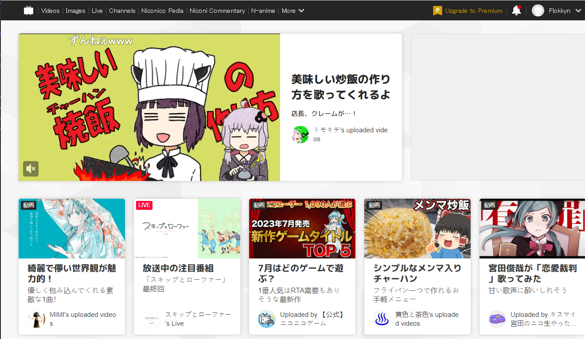

# Plan de recherche pré-vacances d'été

Cette méthode de recherche est en lien direct avec la présentation du 01/06/2023 dans 03 - DATA:

https://github.com/flokkyn/thesis-template/blob/main/03.%20DATA/Presentations_01_06_2023.md

## Sommaire

Le résumé de mon plan d'été se distingue en 4 parties:

 1/ Rappel des termes basiques qui décrivent le sujet.

 2/ Quels sont les points clés qui m'intéressent ?

 3/ Méthodologie de recherches.

 4/ Futures lectures

## 1/ Rappel des termes basiques qui décrivent le sujet

**Vocaloid:** Logiciel de synthèse vocale permettant de composer des musiques à l'aide de banques de voix intégrées à l'intérieur. Permet ainsi de créer des musiques sans avoir de chanteur·euses.
Cependant attention, ces banques de voix peuvent prendre origine sur de réel·les chanteur·euses comme pour la voice actress d'Hatsune Miku se nommant *Saki Fujita*.

**Origine:** Le logiciel de synthèse vocal doit ses origines à *Yamaha Corporation*. Les principales figures que l'on connaît des Vocaloids ont été développé et appartiennent à l'entreprise *Crypton Future Media*.

Les figures connues sont des personnages avec des banques de voix qui leur sont propres et à qui on a donné des figures et animations (d'inspiration manga = bande dessinée japonaise).

Les 6 figures les plus connues sont: Hatsune Miku, Rin Kagamine, Len Kagamine, Kaito, Meiko Hakine et Megurine Luka.

###### (Les 6 figures cryptons)

**Particularité:** Ces personnages qui étaient à l'origine des outils destinés aux professionnels de la musique, ont finalement trouvé leur place sur la scène amateur grâce à la plus connue d'entre elleux nommée *Hatsune Miku* (celle aux couettes bleues turquoises). En effet, alors qu'elle naît le 31 août 2007, sa popularité grandit au sein des fans dès septembre 2007 sur la plateforme de réseau social vidéo japonaise *Nico Nico Douga*. Différents fans s'approprient le personnage pour lui créer des chansons, dessinent des fanarts etc etc.

###### (Logo du réseau social Nico Nico Douga)

###### (Interface du réseau social Nico Nico Douga)

##  2/ Quels sont les points clés qui m'intéressent ?

J'avais parlé dans ma précédente présentation d'une problématique encore en construction qui s'appellerait:

*"Horizons mixes: Comment les Vocaloids dessinent-iels leurs multiples visages en même temps?"*

Ce que je souhaite explorer lors de mes recherches serait:

- La réappropriation d'un concept par le public. Est-ce qu'il redessine sans cesse de nouvelles perspectives pour ses personnages? Ou au contraire est-ce qu'il perpétue une image déjà pré-dessinée par leurs concepteurs?

- Y a-t-il alors une repolitisation possible de ces personnages? Ne sont-ils que des coquilles vides dans lesquels on influe n'importe quelle idée possible? Ou sont-ils porteurs de stéréotypes sociétaux?

- Comment peuvent coexister entreprise et figures amateures?

Pour les deux premiers points, ce sont des pistes qui devraient être poursuivies en interviews plus précises (refaire des questionnaires ciblant mes intérêts).

## 3/ Méthodologie de recherches.

- Poursuite des interviews. Poursuivre avec des gens que j'ai déjà interviewé to go deeper. Essayer de trouver de nouvelles personnes?

/!\ Faire attention à ma vision de la culture japonaise à travers mon mémoire, pour éviter les points de vues exotisants et occidentaux.

/ Prévenir dans le prologue de mon point de vue occidental et que mes écrits s'inscrivent donc dans cette logique?

/ Interviews hors occident? Eventuellement difficultés car barrière de la langue.

- Contacter Agnès Giard pour la questionner sur comment pourrais je traiter mon sujet dans un cadre de non-exotisation. Comment traiter du sujet en sachant qu'il prend racine dans une culture qui n'est pas la mienne, malgré qu'il est était exporté partout dans le monde et que j'y ai donc été exposé assez jeune dans les médias que je consommais.
Etant également dans mes références, j'aimerais la questionner au sujet des love dolls et du rapport humain/image fictive (bien que dans son cas il s'agisse d'objets réels et non pas 2D).

- J'aimerais également interviewer Akihito Kondo qui est un homme japonais de la quarantaine qui a épousé Hatsune Miku, demander des conseils pour le faire en évitant que cela tourne à un aspect bête de foire. Ce qui m'intéresse de sa vision de son mariage est qu'il dit qu'il n'a pas marié Hatsune Miku même mais le concept d'elle présent chez lui. Je me demande si Agnès Giard pourrait m'aider côté barrière de la langue.

- Poursuivre mon enquête sur Nico Nico Douga. Site d'essort d'Hatsune Miku. Quelques éléments déjà trouvés.

- Exploration des utau / utauloids, qui fonctionnent exactement comme les Vocaloids à l'instar du fait que c'est en accès libre et donc totalement gratuit.
Que font les gens avec ces outils? Imiter les vocaloids? Créer de nouvelles possibilités? Voir pour interviewer des gens de ce milieu (en trouver).

## 4/ Futures lectures

Quelques références de ce que je souhaite lire pendant le summer break.

**Academia:**

Cyborg: From Science Fiction to Social Reality (working paper) - Jelena Guga
https://www.academia.edu/2402451/Cyborg_From_Science_Fiction_to_Social_Reality_working_paper_?email_work_card=view-paper

Virtual Idol Hatsune Miku: New Auratic Experience of the Performer as a Collaborative Platform - Jelena Guga
https://www.academia.edu/9431519/Virtual_Idol_Hatsune_Miku_New_Auratic_Experience_of_the_Performer_as_a_Collaborative_Platform?email_work_card=view-paper

The Hatsune Miku Phenomenon: More Than a Virtual J-Pop Diva - Ya Kan Lam
https://www.academia.edu/37067671/The_Hatsune_Miku_Phenomenon_More_Than_a_Virtual_J_Pop_Diva?email_work_card=view-paper

Book Chapter: Vocaloids and Japanese Virtual Vocal Performance: The Cultural Heritage and Technological Futures of Vocal Puppetry - Mike Dines
https://www.academia.edu/37067671/The_Hatsune_Miku_Phenomenon_More_Than_a_Virtual_J_Pop_Diva?email_work_card=view-paper

Hatsune Miku: an uncertain image - Stina Hasse
https://www.academia.edu/34818984/Hatsune_Miku_an_uncertain_image?email_work_card=view-paper

Baudrillard's The Conspiracy of Art: Miku Hatsune and Redefining the Value placed on Authenticity - James Aksman-Glosz
https://www.academia.edu/2233529/Baudrillards_The_Conspiracy_of_Art_Miku_Hatsune_and_Redefining_the_Value_placed_on_Authenticity?email_work_card=view-paper

2.5 Dimention - Anzu Suzuki
https://www.academia.edu/7345358/2_5_Dimention?email_work_card=view-paper

A Study of Transnational Idol Otaku: Playful expressions of Japanese creative culture - Jonathan Lin
https://www.academia.edu/6447888/A_Study_of_Transnational_Idol_Otaku_Playful_expressions_of_Japanese_creative_culture?email_work_card=title

Converging Contents and Platforms: Niconico Video and Japan's Media Mix Ecology, Draft for Joshua Neves and Bhaskar Sarkar ed., Asian Video Cultures (Duke University Press) - Marc Steinberg
https://www.academia.edu/30802910/Converging_Contents_and_Platforms_Niconico_Video_and_Japans_Media_Mix_Ecology_Draft_for_Joshua_Neves_and_Bhaskar_Sarkar_ed_Asian_Video_Cultures_Duke_University_Press_?email_work_card=view-paper

Gynoid and Artificial Intelligence in Japanese Character Intimacy - Luca Bruno

https://ritsumei.repo.nii.ac.jp/?action=repository_action_common_download&item_id=17673&item_no=1&attribute_id=22&file_no=1

International Symposium “Desired Identities - New Technology-based Metamorphosis in Japan”, 27-28 June 2020 - Agnès Giard
https://www.academia.edu/43176597/International_Symposium_Desired_Identities_New_Technology_based_Metamorphosis_in_Japan_27_28_June_2020?email_work_card=view-paper

Revue: La love doll au Japon : jeux imaginaires, incarnation et paradoxes - Agnès Giard
http://www.revue-interrogations.org/La-love-doll-au-Japon-jeux

**Article:**

Love in the Time of Tamagotchi - Daniel Pettman

**Livres:**

Idols and Celebrity in Japanese Media Culture - Patrick W. Galbraith and Jason G. Karlin

Culture participative - Une conversation sur la jeunesse, l'éducation et l'action dans un monde connecté. - Henry Jenkins, Mizuko Ito and Danah Boyd

Idoru - William Gibson