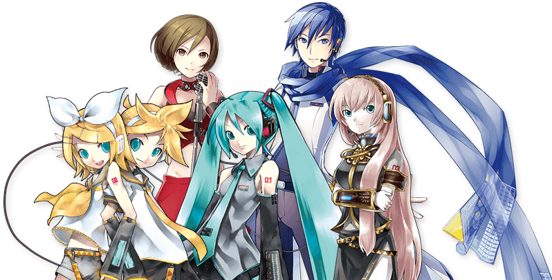

# Presentation of the 01/06/2023

## Topic and research question
**Topic**

My thesis revolves around the subject of Vocaloids.
What is a Vocaloid?
It's basically a vocal synthesis software which allows to create songs with a voice bank account. So you can compose without having a singer.
From this technology, some virtuals figures are born. The most known is called Hatsune Miku.
I hesitate during my researchs if I should work only on Hatsune Miku or others figures as well.
I think I'm gonna work on their 6 more known figures (including Hatsune Miku), all of them belongs to Crypton. They also have more figures but they are less known and also some fanmade vocaloids exists as well.

The big Six: Hatsune Miku, Rin Kagamine, Len Kagamine, Megurine Luka, Meiko Hakine and Kaito (he is the lonely one who doesn't have family name).
A picture of them:

**Research question**

My previous research question was:

***Is Hatsune Miku a social creative catalyst for her community?***

As I said before, I think I'm gonna switch from Hatsune Miku to the globa Six Vocaloids of Crypton.

Also I think my previous question is probably a bit outdated. I don't know how to exactly call it.
I'm more into a question of appropriation and reappropriation of these figures and how their mixity between corporation and public could have modeled them.

Moreover, what I can see from now is that, they don't have one figures but multiples of them. They are very fragmentary characters who were worked on multiples times.

If I would write a problematic it would be more something like:

***Mixed horizons: How did Vocaloids draw their multiple faces at the same time?***

## References

http://henryjenkins.org/blog/2006/09/fan_fiction_as_critical_commen.html

" This goes to the very nature of fan culture: fans write stories because they want to share insights they have into the characters, their relationships, and their worlds; they write stories because they want to entertain alternative interpretations or examine new possibilities which would otherwise not get expressed through the canonical material. "

" The author makes a statement about the characters; the fan writer proposes alternative interpretations of the characters. "

What was interesting to me in this text and these two quotes is the treatment of a same character between their creators and their public.
A creator can put everything they want in their characters but finally, the character's reputation depends of the public.

For my subject, I'm interested about these malleables characters the Vocaloids are and their construction between corporation and public. I also found with my interviews that the public was even a huge part inside Crypton Future Media Corporation.

## Method summary
Since last presentation I worked on interviews.
I got 5 interviewees and 4 interviews (one was with 2 people at the same time).
I got 5 consumers and one of them was also a creator in the Vocaloid community.
I wrote an interview guide and here are the questions which were wrote in it:

Intro
- What's a vocaloid  for you?
- Do you consume vocaloid content?
- Do you have anecdotes about this/these Vocaloid(s)? Memories? Good or bad?
- Do you create Vocaloids content? Are you just a consumer? Or both?
- When will you be listening to/viewing/consuming Vocaloids?
- How do you talk about Vocaloids? Are they objects? Entities? A consumption? A friend?

Self-building
- At what age did you start listening to/viewing/producing Vocaloids?
- Did Vocaloids play a part in your aesthetic appreciation? Clothes style, definition of beauty etc.
- Do you think these standards are achievable in reality?
- Do you think the age at which you started consuming this type of content play a role in your development as an adult?

Socialization
- Do you interact with people from the Vocaloid community? If so, how often?
- How did you meet them? On social networks? In real life?
- What kind of bonds did you forge?
- Do you think your social circle would have been similar without your relationship with Vocaloids? If not, how do you think this community would have altered your circle?
- ( For Cosplayers ) Has cosplay helped to integrate this community?
- ( For Cosplayers ) Does your relationship with cosplay also extend to Vocaloids?

Financial Aspect
- Do you buy Hatsune Miku or other Vocaloids merchandise? If so, how often?
- "Vocaloid" was originally a synthesis software for professionals. Did you know that?
- Do you think Vocaloids can be linked to overconsumption and merchandising?

Final
- Is there anything you'd like to share that hasn't been covered?

During these interviews I tried to estblish a global map/vision about some folks of the Vocaloid community, trying to create link between them to see what was the big "wires" between them.

## Datas from method

1 / The average age at which people start listening to vocaloids is 12. The youngest age was 8 and the oldest age was 14.
Also it seems that the golden age of vocaloids was around 2010-2014. At the beginning of the age teen, because all my interviewees were in their 20's.

2 / Most of my interviewees told me that they were listening to Vocaloids periodically.
It's not always compatible with listening to human singers at the same time.
One of my interview told me that it could have a link with the Youtube's algorithm and how you can easily fall in a hole: link with others similars songs.

3 / Most of my interviewees had a link with one particular characters (particulary from the Crypton's one).
They followed the evolution of their special chosen one.

Stories about characters were mentionned few times.

a / Fragmentation of characters:

One of my intervieew said: " Hatsune Miku is more than the generic one used by commercials in their advises. She has multiples versions of her. For example you have Hagane Miku which is a version of Miku which was created to be in a rock style with a different personnality. Even in the software she has a slightly different one from Miku, made to be more "rock".

Also, everyone loved to dress up Miku, creating designs for her. "

The last sentence is also related to the personnification of Crypton characters. How people appropriate these characters to them. The same intervieew told me about RP.

Hatsune Miku + Hagane Miku comparison:

b / Also was discussed the question of storytelling. Some songs/videos of vocaloid are related together to create stories/lore about them.
It creates some "assigned roles". For example Len is a character who ofte dies in his songs.

4 / a / The question of representation through music was mentionned.

Two of my intervieews told me that when they discovered Vocaloids music they finally representated at the feeling level.
It was the first time they heard sad songs, which they were related to depression, suicide, harassment etc...
It created to them a relatable feeling. At that time for them (around 2012), music was made to amuse people, for party. And here they felt heard by music.
However, I found that a link between 4/5 of my interviewees was sadness. With the two above, I also had one person who told me that they wrote poem on suicide since the age of 8. Also a second one told me that they were really isolate during his vocaloids phase, treated as the nerd of the class (also because of isolation due to his weeb culture).

b / Everyone talked to me about the composers and questions about the place of them in the vocaloid music.

One told that for once, composers were put in the spotlight because usually they are masked by the popularity of singers.

Composers put in the front the subjects of sadness, someone told me it was cathartic.

Communities have become attached to composers.

My last intervieew asked me, are people more attached to vocaloids or compositors behind?

5 / The financial question has some variables.

I had one people who bought a lot of merch (65 cosplays of Rin only).
Two others bought merch but not a lot (figurines, lightsticks etc).
One other is dreaming about having a massive collections of merch but doesn't have financial occasions for the moment.
One other bought nothing because it's not necessary for her, and also very expensive.

Crypton Future Media is guilty about surconsommation and abuse towards users because:

- Permanant collection of merchchange every seasons and they create new events every 2 weeks to sell merch as well.
- During one concert which was a tribute to the deceased composer Wowaka, they did a sponsored advise about a guitar.
- They regulary organize outfits designs competition on social media (ex:Pixiv) where fans post new designs where they are not paid for. It's free works. 

The last point tend to have similarities with the process of the industry of idols in Japan, using similar mechanisms.